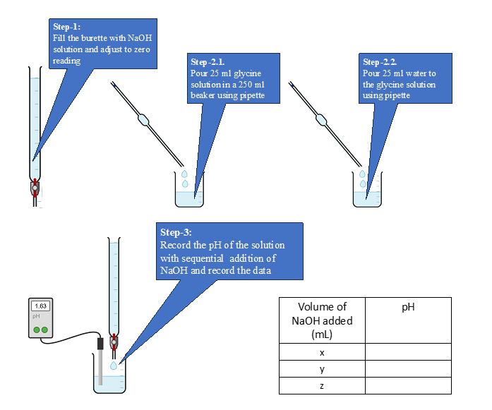
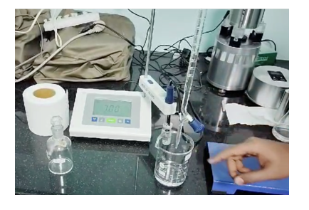
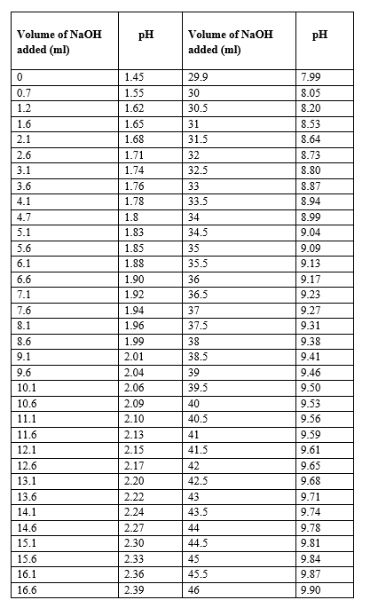
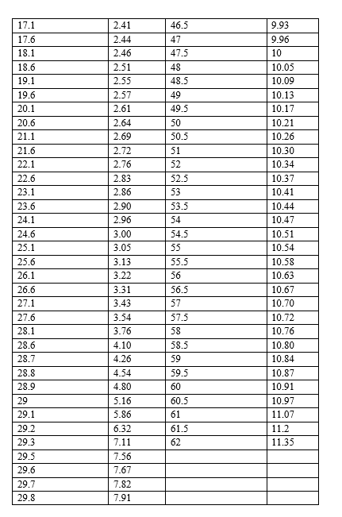
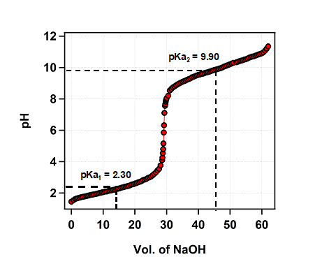
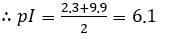

<b>Glassware required : </b> 
1)	Burette and Pipette  
2)	Conical flask (150 ml)  
3)	Measuring cylinder   
4)	pH meter   

<b>Chemicals required : </b> 
1)	NaOH solution (0.1 M) 
2)	HCl (0.25 N) 
3)	KCl solution (1 M) 
4)	Glycine (0.1 M) 
5)	Distilled water.  

<b>Laboratory procedure : </b> 
1)	Take 50 mL of NaOH solution (0.1 M) in a 50 mL burette and adjust zero reading. 
2)	Pipette out 25 mL of the given solution of glycine in a 250 mL beaker and add 25 mL of distilled water to the amino acid solution using pipette. 
3)	Insert the cleaned pH electrode into the beaker solution and record the initial pH of the solution. 
4)	Do not remove the electrode from the beaker till the end of the experiment.  
5)	Add NaOH in 0.5mL increment from the burette. Stir the solution and mix it well. 
6)	Record the corresponding pH values until the pH starts increasing drastically. At this time, add 0.1 mL increments of NaOH till the pH stabilizes around 8. 
7)	After reaching pH 8, continue adding 0.5 mL increments of NaOH till you reach pH 11. 
8)	Plot the graph of pH vs volume of NaOH solution. 
9)	The two almost horizontal parts of the graph give the values of pKa1 and pKa2 for glycine. Use mid-points of these regions to get the values. 
10)	The average of these values (pKa1 and pKa2) gives the pI of glycine.  

<b>Precautions : </b> 
1)	Handle the burette carefully. 
2)	Take the reading of 0.5 ml interval continuously. 
3)	pH-meter calibration must be done carefully. 
4)	Allow the pH meter reading to stabilize before recording each value to minimize errors in the titration curve.  

<b>Laboratory procedure (diagram) : </b> 
  

<b>Procedure in laboratory : </b> 
  

<b>Data & Analysis : </b> 
 
  

<b>Graph : </b> 
  

<b>Result : </b> 
From the graph, the pKa1 is estimated to be 2.3 
From the graph, the pKa2 is estimated to be 9.9 

  