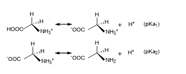
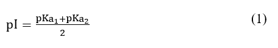
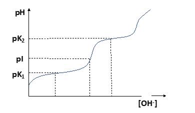

Proteins and amino acids contain both acidic (–COOH) and basic (–NH2) groups in their structures and are amphoteric in nature. The net molecular charges of such molecules can vary depending upon the pH of the medium. Hence if we apply an electric field across the solution, the molecules will move towards either cathode or anode depending upon the nature of the charge. The isoelectric point (pI) is the pH at which a molecule carries no net charge and hence will not show any movement in the electric field. When pH < pI, molecules carry a net positive charge and when pH > pI, they carry a net negative charge. 

For an amino acid having only one –NH2 and one –COOH group, the calculation of pI can be very simple if the pKa values are known. Glycine is the simplest amino acid containing one –NH2 and one –COOH group. It can exist in three ionic forms: 
H3N+-CH2-COOH (at pH = 1), H3N+-CH2-COO- (at pH = 6) and H2N-CH2-COO- (at pH = 11). The two pKa values arise from the equilibrium given in Fig. 1. 

 

<b>Figure 1. </b>Protonation and de-protonation of glycine  

pI can be written as 

 

The determination of isoelectric point (equivalence point) of titrations based on potential measurements is called potentiometric titration. The equivalence point is indicated by a large change in the potential. A good potentiometric titration requires a suitable working electrode and a standard reference electrode. This is where pH meter can be used. Let us consider the potentiometric titration of glycine vs NaOH solution. With the gradual addition of NaOH, the change in pH will be similar to the curve given in Fig. 2.   

  

As we can see in the titration curve, it has two dissociation steps corresponding to loss of H+ from the acidic carboxyl group at low pH followed by loss of H+ from the more basic amino group at high pH. The pKa value for each dissociable group of an amino acid can be determined from such a titration curve by extrapolating the midpoint of each buffering region (the plateau) in the titration curve. The diagram also shows that there is a point in the curve where the amino acid behaves as a neutral salt. At this pH, the amino acid is predominantly a zwitterion with a net charge of zero. This point of the titration curve is the isoelectric point (pI) and can be approximated as halfway between the two points of strongest buffering capacity (the two pKa values).